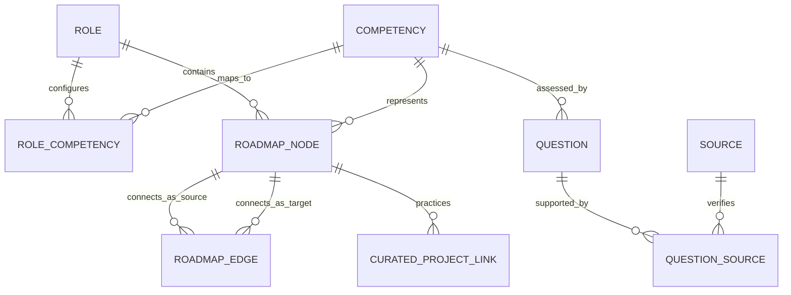

# SkillProof V2.1A — Data V3 Schema Proposal

**Milestone**: V2.1A (Data Design Proposal)  
**Status**: NON-PRODUCTION SCHEMA PROPOSAL (Human Review Required)  
**Date**: 2026-09-16  
**Auditor**: Antigravity Autonomous Agent  

---

## 1. Objective

This document proposes the target **Data V3** schema structure to replace the flat, single-role V2 schema during Milestone V2.1B. 

The design provides a normalized, extensible foundation capable of supporting:
1. Multi-role canonical skill catalogs (Frontend, Backend, Data Analyst).
2. True directed graph topology for personalized learning roadmaps.
3. Strict provenance tracing back to authoritative roadmaps and official documentation.
4. Clean separation between assessable interview competencies, elective frameworks, and career toolkits.
5. Future-proof linkages for curated practice projects (V2.5).

---

## 2. Conceptual Architecture Diagram



---

## 3. Proposed Normalized Entities

### 3.1 `Role`
Represents an overarching professional career target.
```json
{
  "id": "frontend-developer",
  "title": "Frontend Developer",
  "description": "Specializes in building web interfaces, client-side applications, and browser interactions.",
  "status": "active",
  "roadmapSourceUrl": "https://roadmap.sh/frontend",
  "displayOrder": 1
}
```

### 3.2 `Competency` (Canonical Skill Entity)
Represents a distinct, reusable skill or conceptual unit.
```json
{
  "id": "shared.sql",
  "name": "SQL & Relational Data Querying",
  "slug": "sql",
  "typology": "assessable-competency",
  "scope": "shared",
  "description": "Querying relational database engines using SQL syntax, multi-table joins, aggregations, and subqueries.",
  "canonicalRoadmapUrl": "https://roadmap.sh/backend#relational-databases",
  "provenanceType": "roadmap-derived"
}
```

### 3.3 `RoleCompetency` (Junction Entity)
Defines how a canonical competency functions within a specific role.
```json
{
  "roleId": "backend-developer",
  "competencyId": "shared.sql",
  "category": "core",
  "importance": "high",
  "assessmentEligibility": true,
  "mandatoryFundamental": true,
  "isToolkitOnly": false,
  "isOptional": false,
  "displayOrder": 3
}
```

### 3.4 `RoadmapNode` & `RoadmapEdge` (Graph Topology)
Enables graph traversal, prerequisite gating, and personalized subgraph generation.
```json
{
  "nodeId": "node-be-sql-joins",
  "roleId": "backend-developer",
  "competencyId": "shared.sql",
  "label": "SQL Joins & Normalization",
  "roadmapShNodeId": "database-indexes",
  "roadmapShLocator": "https://roadmap.sh/backend#relational-databases",
  "nodeType": "concept",
  "recommendedOrder": 12,
  "learningSummary": "Understanding INNER, LEFT, RIGHT, FULL OUTER joins and 1NF/2NF/3NF normalization principles."
}
```
```json
{
  "edgeId": "edge-sql-to-db-indexes",
  "sourceNodeId": "node-be-sql-joins",
  "targetNodeId": "node-be-db-indexes",
  "relationType": "prerequisite"
}
```
*Supported `relationType` enums*:
- `prerequisite`: Hard conceptual prerequisite.
- `recommended-before`: Recommended pedagogical sequence.
- `branch-choice`: Mutually exclusive or elective path (e.g. Choose React OR Vue OR Angular).
- `parent-group`: Hierarchical grouping node.

---

## 4. Personalized Candidate State Tracking Schema

For the future personalized roadmap runtime, each canonical roadmap node will be capable of receiving a candidate state representation:

```json
{
  "candidateId": "usr_94812",
  "roleId": "backend-developer",
  "nodeId": "node-be-sql-joins",
  "evaluationState": "Demonstrated",
  "diagnosticScore": 3.0,
  "evaluatedAt": "2026-09-17T00:15:00Z",
  "roadmapStatus": "Completed",
  "unassessedDefault": false
}
```

### Allowed Node States:
1. `Demonstrated`: Evaluated at Intermediate or Advanced level.
2. `Needs Development`: Evaluated at Beginner level; scheduled as high-priority roadmap milestone.
3. `Insufficient Evidence`: Tested, but response showed severe gaps; scheduled as foundational review.
4. `Not Assessed`: Candidate did not select or was not tested on this skill; included in roadmap as recommended coverage without score penalty.
5. `Available`: Ready to learn; prerequisites satisfied.
6. `Locked`: Prerequisite roadmap nodes have not yet been demonstrated.
7. `Completed`: Marked completed by candidate via practical project or verified exercise.
8. `Optional`: Elective specialization node.

---

## 5. Curated Project Linkages (Anticipating V2.5)

To eliminate unverified AI project generation, the schema links canonical nodes directly to curated project blueprints:

```json
{
  "projectId": "proj-be-rate-limiter",
  "title": "Distributed API Rate Limiter Service",
  "primaryCompetencyId": "backend.resilience-patterns",
  "secondaryCompetencyIds": ["shared.sql", "backend.caching"],
  "difficulty": "applied",
  "sourceCatalog": "project-based-learning",
  "sourceUrl": "https://github.com/practical-tutorials/project-based-learning#c",
  "verifiedAt": "2026-09-16"
}
```

---

## 6. Migration Plan for Existing Database

In Milestone V2.1B:
1. Preserve existing SQLite schema backwards-compatibility via view layer or additive EF Core entities.
2. Map existing `Question` and `Rubric` tables to `CompetencyId` foreign keys.
3. Reconcile database seeding using the hardened bidirectional `CatalogSeeder` pattern proven in V2.0.
